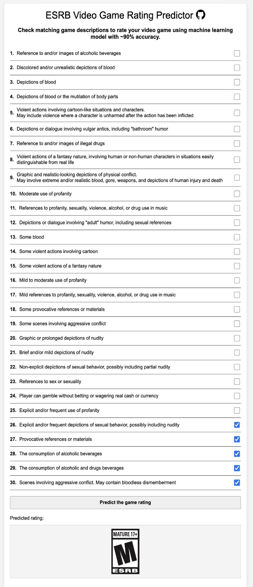

# ESRB Video Game Rating Predictor

## Overview

This project aims to build a ML model which can be used to predict ESRB (Entertainment Software Rating Board) ratings for video games **with ~90% accuracy** basing on their content descriptors.

It's able to classify games into one of the following age groups:

- Everyone
- Everyone 10+
- Teen
- Mature 17+

For more information about ESRB rating categories, refer to the [ESRB Ratings Guide](https://www.esrb.org/ratings-guide/).

## Machine Learning Approach

The model in this project utilizes **supervised learning**, a type of machine learning. It is trained on a dataset containing game content descriptors paired with their corresponding ESRB ratings. The training process involves the model learning the patterns and relationships between content descriptors and ratings, allowing it to make accurate predictions for unseen games.

## Content Descriptors

See [descriptors.md](descriptors.md).

## Model Usage Example

Script:

```python
import pickle
import numpy as np

# Load the ESRB model from the pickle file
with open('esrb-model.pkl', 'rb') as file:
    esrb_model = pickle.load(file)

# Example game data (an array of 31 content descriptor values)
Minecraft = np.array([0,0,0,0,0,0,0,1,0,0,0,0,0,0,0,0,0,0,0,0,0,0,0,0,0,0,0,0,0,0,0])

# Predict ESRB rating based on game data
def predict_esrb_rating(game_data):
    predicted_rating = esrb_model.predict(game_data.reshape(1, -1))
    if predicted_rating[0] == 0:
        return "Everyone"
    elif predicted_rating[0] == 1:
        return "Everyone 10+"
    elif predicted_rating[0] == 2:
        return "Teen"
    else:
        return "Mature 17+"

print(predict_esrb_rating(Minecraft))
```

Output:

```
Everyone 10+
```

## [Web App](./webApp/)

You can also run this model as a web application, which provides an interactive interface for predicting ESRB ratings based on game content descriptors. The web app is built using Flask for the backend API and includes frontend files (HTML, CSS, and JS) to create a user-friendly interface.


